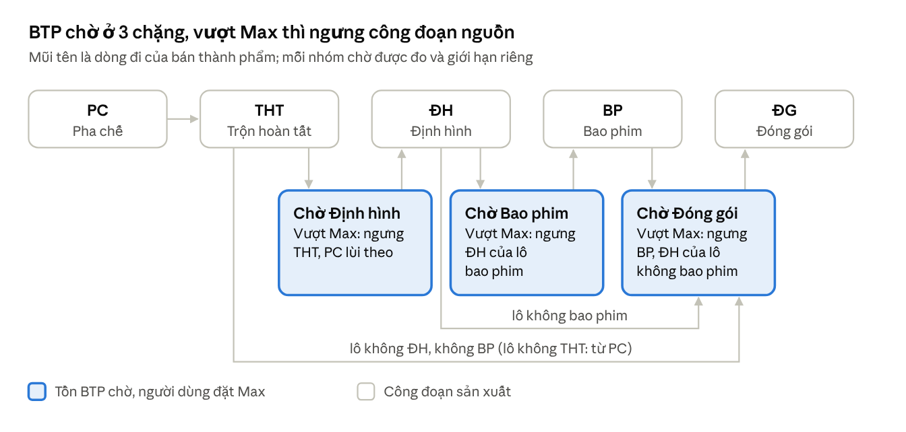

# Nguyên lý Sắp lịch tự động và Kiểm soát tồn BTP

Phiên bản 1.1 · 10/10/2026

Hệ thống xếp lịch sản xuất theo hai lớp. **Sắp lịch tự động** đưa mọi lô vào phòng sớm nhất có thể mà vẫn đúng ràng buộc. **Kiểm soát tồn BTP** chạy ngay sau đó, giãn đầu nguồn để bán thành phẩm chờ giữa các công đoạn không vượt mức tối đa người dùng đặt.

## Tổng quan

Sắp lịch tự động xếp các công đoạn từ Pha chế tới Đóng gói (Phần 1). Kiểm soát tồn BTP đo 3 nhóm chờ và giãn công đoạn nguồn khi nhóm đó vượt Max (Phần 2).

## Thuật ngữ viết tắt

| Viết tắt | Ý nghĩa |
| --- | --- |
| PC | Pha chế |
| THT | Trộn hoàn tất |
| ĐH | Định hình (dập viên, đóng nang) |
| BP | Bao phim |
| ĐG | Đóng gói / Ép vỉ |
| BTP | Bán thành phẩm: sản phẩm đã qua một số công đoạn, đang chờ công đoạn tiếp theo |
| NL / BB | Nguyên liệu / Bao bì |
| HH | Hết hạn |
| BT-HC-TI | Lịch Bảo trì, Hiệu chuẩn, Tiện ích của thiết bị và phòng |
| Chiến dịch | Nhóm lô cùng sản phẩm chạy liền nhau trong một phòng |
| Max | Mức tồn tối đa người dùng đặt cho một nhóm chờ (đơn vị viên) |

## Phần 1 – Sắp lịch tự động

### 1.1. Dữ liệu đầu vào

Hệ thống chỉ xếp các công đoạn chưa có lịch; lô đã chạy hoặc đang chạy giữ nguyên. Mỗi lần xếp dựa trên các dữ liệu sau:

| Dữ liệu | Hệ thống dùng để |
| --- | --- |
| Kế hoạch sản xuất: lô, sản phẩm, số lượng, ngày cần hàng | Biết lô nào cần xếp và lô nào gấp hơn |
| Định mức theo sản phẩm và công đoạn | Biết phòng nào được chạy, thời gian chuẩn bị và sản xuất mỗi lô, thời gian vệ sinh cấp I / cấp II, số lô tối đa của một chiến dịch |
| Ngày có đủ NL, Ngày được phép cân, Ngày có đủ BB | Mốc **sớm nhất** lô được bắt đầu |
| Ngày HH NL chính, Ngày HH BB, hạn PC / THT / ĐH / BP / ĐG trước | Mốc **muộn nhất** lô phải bắt đầu |
| Thời gian chờ giữa hai công đoạn (biệt trữ, chờ kết quả kiểm nghiệm); lô thẩm định chờ lâu hơn | Khoảng cách tối thiểu giữa hai công đoạn của cùng một lô |
| Ngày không sắp lịch (ngày nghỉ) | Lô không bắt đầu trong ngày nghỉ (06:00 hôm đó tới 06:00 hôm sau) |
| Lô đang thực thi (đã nhận phòng) | Phòng được coi là bận tới giờ dự kiến kết thúc của lô đó |
| Khuôn ép vỉ đang gắn trên máy | Hạn chế thay khuôn ở công đoạn Đóng gói |

### 1.2. Chiến dịch: gom lô để chạy liền mạch

Các lô cùng sản phẩm, ngày cần hàng gần nhau được gom thành một chiến dịch, tối đa bằng số lô trong định mức. Chiến dịch chạy liền trong cùng một phòng: giữa các lô chỉ vệ sinh cấp I, hết chiến dịch mới vệ sinh cấp II.

- **Lợi ích:** ít thời gian vệ sinh, ít lần thay khuôn, phòng chạy được nhiều lô hơn.
- **Xếp nguyên khối:** chiến dịch không bị tách ra nhiều phòng hay nhiều đoạn.
- **Mốc bắt đầu:** không sớm hơn ngày muộn nhất trong các lô của chiến dịch (Ngày có đủ NL, Ngày được phép cân; riêng Đóng gói là Ngày có đủ BB).
- **Từng lô trong chiến dịch** vẫn chờ công đoạn trước của chính nó xong cộng thời gian chờ, rồi mới được bắt đầu.

### 1.3. Thứ tự ưu tiên

Lô được xếp theo nhóm. Nhóm đứng trước chọn phòng và giờ trước, nhóm sau lấp vào chỗ còn trống.

1. **Lô sắp trễ Ngày HH NL chính / HH BB:** được chen lên đầu, kèm cả chiến dịch của lô (xem mục 1.5).
2. **Bán thành phẩm:** lô đã có công đoạn trước trên lịch, cần xếp tiếp để không tồn đọng; lô có công đoạn trước chạy sớm hơn xếp trước.
3. **Lô có ràng buộc NL/BB:** lô có ngày hết hạn hoặc hạn công đoạn gần nhất xếp trước.
4. **Sản phẩm nhạy cảm.**
5. **Sản phẩm thương mại còn lại:** theo thứ tự ưu tiên của kế hoạch, lần lượt từng công đoạn từ Pha chế tới Đóng gói.
6. **Hàng khuyến mãi:** xếp sau cùng.

### 1.4. Cách chọn phòng và giờ bắt đầu

Mỗi lô hoặc chiến dịch được đặt vào phòng cho phép bắt đầu sớm nhất, qua 5 bước:

1. **Tính mốc sớm nhất** = ngày muộn nhất trong: thời điểm sắp lịch, Ngày có đủ NL / được phép cân / có đủ BB, giờ công đoạn trước kết thúc cộng thời gian chờ.
2. **Tìm khoảng trống** trong từng phòng được phép: khoảng đầu tiên từ mốc đó đủ chứa lô, kể cả thời gian vệ sinh. Phòng đang chạy lô được tính bận tới giờ dự kiến kết thúc.
3. **Tránh ngày nghỉ:** lô không bắt đầu trong ngày nghỉ, nhưng lô đang chạy dở thì được chạy xuyên qua.
4. **Chọn phòng** cho giờ bắt đầu sớm nhất. Riêng Đóng gói khi bật "Hạn chế xuống khuôn": ưu tiên phòng đang gắn đúng khuôn nếu chỉ bắt đầu trễ hơn không quá số giờ cho phép (mặc định 72 giờ).
5. **Ghi lịch** rồi xếp tiếp công đoạn sau của lô theo cùng cách.

### 1.5. Tự kiểm tra sau khi xếp

Xếp xong, hệ thống tự rà lại hai loại hạn trước khi trả kết quả.

#### a) Ngày HH NL chính và Ngày HH BB không được vi phạm

- Nếu Pha chế bắt đầu sau Ngày HH NL chính, hoặc Đóng gói bắt đầu sau Ngày HH BB, mà vẫn còn kịp: hệ thống hoàn tác và xếp lại, đưa lô đó cùng cả chiến dịch của nó lên đầu hàng.
- Lặp tối đa 3 lần, giữ phương án có ít lô trễ nhất.
- Lô không thể kịp (hạn đã qua trước hôm nay, hoặc trước ngày có đủ NL/BB) được liệt kê riêng để người lập lịch xử lý.

#### b) Lịch bảo trì, hiệu chuẩn, tiện ích (BT-HC-TI)

- Chiến dịch được xếp xuyên qua lịch BT-HC-TI chưa bắt đầu, để không bị cắt khúc. Lô lẻ vẫn tránh lịch BT-HC-TI.
- Lịch BT-HC-TI bị đè được dời sang khoảng trống kế tiếp trong cùng phòng, kể cả ngày nghỉ.
- Nếu dời ra sau làm trễ hạn BT, hệ thống tìm khoảng trống sớm hơn, gần giờ cũ nhất mà vẫn kịp hạn. Hạn BT: hiệu chuẩn đúng ngày tới hạn; lịch hàng tháng thêm 7 ngày; loại khác thêm 21 ngày.
- Không còn khoảng trống kịp hạn thì lịch đó được báo trên màn hình kết quả.

## Phần 2 – Kiểm soát tồn BTP

### 2.1. Vì sao cần kiểm soát tồn BTP

Sắp lịch tự động đưa mọi công đoạn vào sớm nhất có thể. Các công đoạn đầu (Pha chế, Trộn hoàn tất, Định hình) thường nhanh hơn công đoạn sau (Bao phim, Đóng gói), nên bán thành phẩm (BTP) dồn lại chờ.

Tồn BTP cao gây ra:

- Chiếm diện tích kho biệt trữ và vốn nằm chờ.
- Kéo dài thời gian chờ, dễ quá hạn biệt trữ của BTP.
- Không làm hàng ra nhanh hơn, vì đầu ra vẫn bị giới hạn bởi công đoạn sau.

**Người dùng chỉ cần nhập mức tồn tối đa (Max, đơn vị viên)** cho 1, 2 hoặc cả 3 nhóm chờ trên màn hình Sắp lịch tự động; để trống là không giới hạn. Kiểm soát tồn BTP chạy ngay sau khi sắp lịch xong.

### 2.2. Cách đo tồn

Tồn mỗi nhóm là lượng BTP đã ra khỏi công đoạn nguồn nhưng chưa vào công đoạn tiêu thụ. Hệ thống dự báo tồn lúc 06:00 mỗi ngày trong 30 ngày tới, theo đúng lịch vừa xếp; ngày nào tồn lớn hơn Max là một ngày vượt.

| Nhóm chờ | Tồn tăng khi xong | Tồn giảm khi bắt đầu | Khi vượt Max thì ngưng |
| --- | --- | --- | --- |
| Chờ Định hình (ĐH) | Trộn hoàn tất (lô không có THT: Pha chế) | Định hình | Trộn hoàn tất, Pha chế lùi theo |
| Chờ Bao phim (BP) | Định hình của lô bao phim | Bao phim | Định hình của lô bao phim |
| Chờ Đóng gói / Ép vỉ (ĐG) | Bao phim; Định hình của lô không bao phim; Trộn hoàn tất của lô không ĐH, không BP (lô không có THT: Pha chế) | Đóng gói | Bao phim; Định hình của lô không bao phim; THT / PC của lô không ĐH, không BP (khi Chờ Định hình cũng có Max) |

### 2.3. Nguyên lý ngưng nguồn

Công đoạn tiêu thụ (nút cổ chai) giữ nguyên lịch; chỉ đầu nguồn được giãn ra. Một lô chỉ được vào công đoạn nguồn khi dự báo tồn của nhóm nó sắp vào còn dưới Max.

- **Lô chưa được vào thì đợi.** Phòng nguồn không bỏ trống mà chạy thay lô khác, là lô đi vào nhóm không cài Max hoặc nhóm còn dưới Max.
- **Lô cần hàng muộn nhất đợi trước.** Lô sắp tới hạn (ngày cần hàng hoặc ngày NL/BB) được ép chạy đúng giờ dù tồn đang cao.
- **Công đoạn sau lùi theo** lô bị đợi, giữ đúng thứ tự và thời gian chờ.
- **Công đoạn trước được kéo sát lại** (vừa kịp), để không chuyển đống tồn sang nhóm chờ phía trước.

> **Ví dụ minh hoạ** (số liệu giả định): Max Chờ Bao phim = 50 triệu viên, dự báo ngày 15/10 là 62 triệu viên.
>
> 1. Phòng Định hình sắp dập lô X (bao phim, cần hàng 30/11). Chờ Bao phim đang vượt nên lô X đợi.
> 2. Phòng Định hình chạy thay lô Y không bao phim, đi thẳng sang Đóng gói.
> 3. Khi Bao phim rút tồn xuống dưới 50 triệu viên, lô X mới được dập; Bao phim và Đóng gói của lô X lùi theo.
> 4. Trộn hoàn tất của lô X được dời sát ngày dập mới, không để tồn dồn sang Chờ Định hình.

### 2.4. Những điều luôn được giữ và cơ chế an toàn

Kiểm soát tồn BTP chỉ giãn lịch trong phạm vi các ràng buộc sau, không đánh đổi chúng lấy tồn thấp.

- **7 ngày NL/BB:** Ngày được phép cân, Ngày HH NL chính, Ngày HH BB, hạn PC / THT / ĐH / BP trước. Lô bị lùi không được vi phạm các ngày này.
- **Quy tắc phòng:** không đè giờ trong cùng phòng, đúng thứ tự công đoạn và thời gian chờ, không bắt đầu trong ngày nghỉ.
- **Lô không động tới:** lô đã chạy hoặc đang chạy, lô bắt đầu trước ngày sắp lịch.

Cách chạy và cơ chế an toàn:

1. **Tạo bản sao lưu** lịch trước khi sửa; có thể khôi phục bằng nút Khôi phục.
2. **Chạy theo vòng:** đo tồn, ngưng nguồn, đổi chỗ hoặc giãn lịch trong phòng nguồn; không được thì lùi cả chuỗi công đoạn của lô, rồi đo lại.
3. **Mỗi vòng là một giao dịch trọn vẹn:** lỗi giữa chừng thì vòng đó tự huỷ, lịch trở về như trước vòng. Vòng nào làm phát sinh vi phạm ngày NL/BB cũng bị huỷ.
4. **Dừng** khi mọi nhóm đã dưới Max, sau tối đa 10 vòng hoặc 15 phút, hoặc khi 2 vòng liên tiếp không giảm được tồn.
5. **Dời lịch BT-HC-TI** bị lô mới đè lên, theo đúng cách ở mục 1.5.

### 2.5. Kết quả và giới hạn cần biết

Sau mỗi lần chạy, màn hình Kết quả kiểm soát BTP cho biết:

- **Trạng thái:** đạt (mọi nhóm trong Max), hết vòng hoặc hết thời gian mà còn vượt, không khả thi, hoặc dừng để giữ ngày NL/BB.
- **Tồn trước và sau** của từng nhóm: đỉnh tồn, ngày đỉnh, số ngày vượt Max.
- **Danh sách lô bị lùi**, công đoạn lùi theo, và lô được kéo lên sớm hoặc chạy thay.
- **Cảnh báo:** lô phải chạy đúng hạn, chiến dịch mới bị quá hạn biệt trữ, lịch BT-HC-TI đã dời.

Giới hạn cần biết:

- **Giảm tồn đổi lại đầu nguồn chạy muộn hơn.** Lô cần hàng muộn có thể ra thành phẩm trễ hơn lịch trước khi kiểm soát.
- **Max quá thấp so với năng lực công đoạn sau** thì không đạt được, màn hình báo không khả thi. Khi đó nên nâng Max hoặc tăng năng lực Bao phim / Đóng gói.
- **Tồn từ lô đã chạy không giảm được**, vì các lô này không được dời.
- **Vi phạm có sẵn** trong lịch trước khi kiểm soát không được sửa ở bước này; kiểm soát BTP chỉ bảo đảm không phát sinh vi phạm mới.
